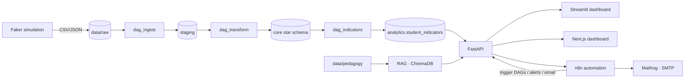
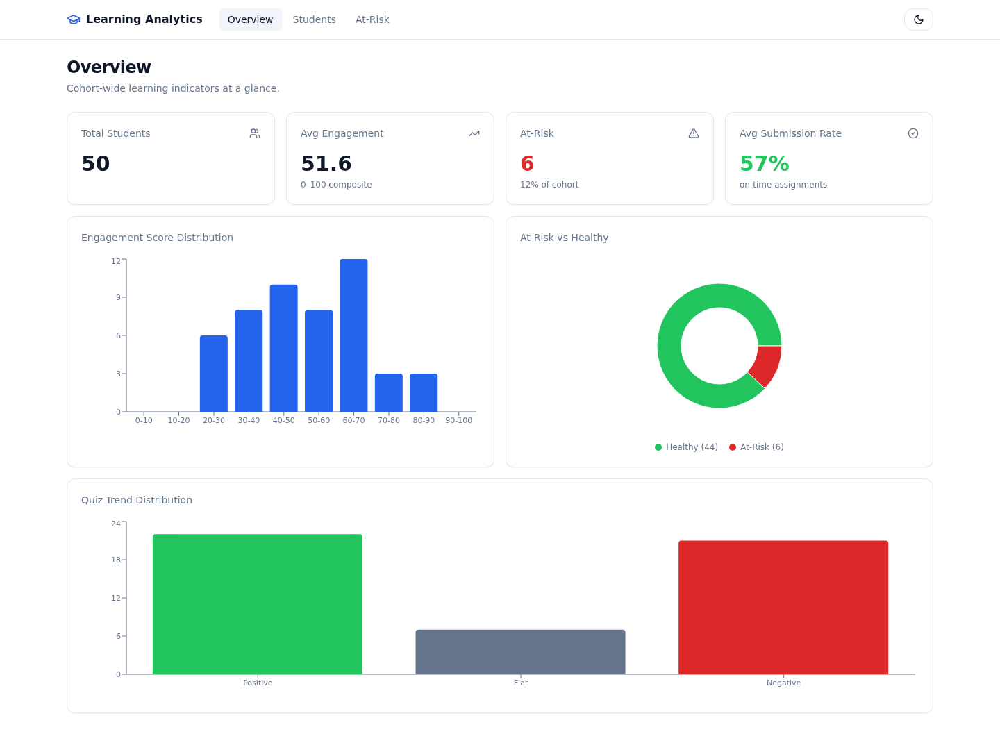
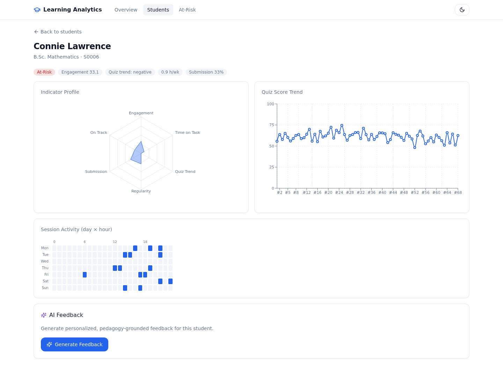
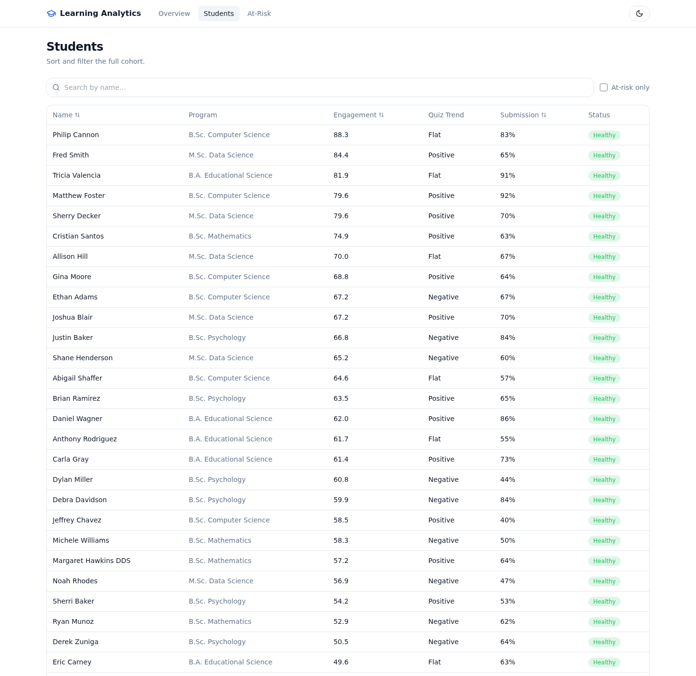
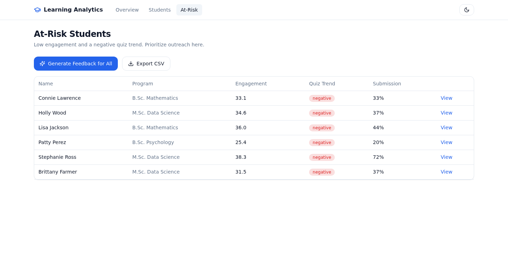

# Student Learning Analytics & AI Feedback System

[](https://github.com/Khanetic/student-learning-analytics/actions/workflows/ci.yml)
[](https://www.python.org/)
[](LICENSE)

An end-to-end **learning analytics platform** that simulates a Learning
Management System (LMS), runs an orchestrated data pipeline into a PostgreSQL
star schema, computes per-student learning indicators, and generates
personalized, pedagogy-grounded AI feedback through a Retrieval-Augmented
Generation (RAG) pipeline — all surfaced on an interactive dashboard and a
documented REST API.

The project is inspired by learning analytics research at **CATALPA / LEAD:FUH
(FernUniversität Hagen)**. It is fully containerized: a single
`docker compose up` brings up the database, orchestration, vector store, API,
two dashboards (Streamlit + Next.js), and an n8n automation layer. The RAG
pipeline runs offline with a deterministic mock provider and transparently
upgrades to OpenAI when an API key is supplied, so the system demos end-to-end
with **zero secrets required**.

---

## Features

- **Realistic LMS simulation** — deterministic, Faker-generated students,
  sessions, page views, quiz attempts, and assignment submissions driven by a
  latent per-student engagement profile.
- **Orchestrated ETL** — idempotent Apache Airflow DAGs load raw data through a
  staging layer into a dimensional **star schema**, gated by a reusable data
  quality layer (missing values, out-of-range values, duplicates, referential
  integrity).
- **Learning indicators** — engagement, time-on-task, quiz-score trend, session
  regularity, on-time submission rate, and an at-risk flag, implemented as pure,
  unit-tested functions.
- **RAG feedback** — pedagogy documents embedded into ChromaDB; a student's
  indicator profile retrieves relevant guidance, and a LangChain chain generates
  a three-paragraph, personalized message (OpenAI or offline mock).
- **REST API** — a frontend-agnostic FastAPI service with a typed Pydantic
  contract, proper status codes, and CORS.
- **Two dashboards** — a multi-page **Streamlit** app (Plotly) and a modern
  **Next.js 14** app (TypeScript, Tailwind, shadcn-style UI, Recharts) with
  loading skeletons, dark mode, and a mobile-responsive layout. Both consume the
  API only (no direct database access) and degrade gracefully when the backend
  is unavailable.
- **Workflow automation (n8n)** — an event-driven layer alongside Airflow:
  at-risk alerts, weekly feedback delivery, pipeline trigger/monitor,
  human-in-the-loop teacher review, and student onboarding. Ships with a Mailhog
  SMTP sink and importable, pre-credentialed workflows.
- **Production hygiene** — full containerization, environment-driven config (no
  hardcoded secrets), GitHub Actions CI (lint, tests, frontend build, image
  builds), and a reproducible, seeded data pipeline.

---

## Architecture



A single shared package (`src/sla`) holds all business logic — simulation, ETL,
indicators, RAG, and API — so the Airflow DAGs, the API service, and the test
suite reuse exactly the same code.

---

## Tech stack

| Layer            | Technology                                  |
| ---------------- | ------------------------------------------- |
| Language         | Python 3.11+                                |
| Orchestration    | Apache Airflow 2.9                          |
| Storage          | PostgreSQL 16 (star schema)                 |
| Containerization | Docker + Docker Compose                     |
| Data processing  | Pandas + NumPy                              |
| RAG / LLM        | LangChain + OpenAI (offline mock fallback)  |
| Vector store     | ChromaDB                                    |
| Backend API      | FastAPI + Uvicorn                           |
| Dashboards       | Streamlit + Plotly · Next.js 14 + Recharts  |
| Automation       | n8n + Mailhog (local SMTP)                   |
| CI/CD            | GitHub Actions                              |
| Testing / lint   | pytest + ruff                               |

---

## Quickstart

**Prerequisites:** Docker and Docker Compose.

```bash
git clone https://github.com/Khanetic/student-learning-analytics.git
cd student-learning-analytics
cp .env.example .env                 # optional: add OPENAI_API_KEY for real LLM

docker compose up -d --build         # full stack (DB, Airflow, Chroma, API, both UIs, n8n, Mailhog)
make pipeline                        # run ingest -> transform -> indicators DAGs
make rag-ingest                      # embed pedagogy docs into ChromaDB
```

| Service             | URL                          | Notes                       |
| ------------------- | ---------------------------- | --------------------------- |
| Next.js dashboard   | http://localhost:3000        | primary UI (TS/Tailwind)    |
| Streamlit dashboard | http://localhost:8501        | original UI                 |
| FastAPI + Swagger   | http://localhost:8001/docs   | REST API                    |
| Airflow             | http://localhost:8080        | `admin` / `admin`           |
| n8n                 | http://localhost:5678        | automation (no login, dev)  |
| Mailhog             | http://localhost:8025        | local email inbox           |

> Runs **fully offline** — no `OPENAI_API_KEY` required (deterministic mock provider).
> If a host port is already in use, override `POSTGRES_HOST_PORT`, `API_HOST_PORT`,
> `STREAMLIT_HOST_PORT`, or `NEXTJS_HOST_PORT` in `.env`. For n8n setup see
> [`n8n/README.md`](n8n/README.md).

---

## Configuration

All configuration is environment-driven via `.env` (see `.env.example`); no
secrets are hardcoded. Key variables:

| Variable                | Purpose                                                  |
| ----------------------- | -------------------------------------------------------- |
| `SLA_SEED`              | random seed for reproducible simulation                  |
| `SLA_N_STUDENTS`        | cohort size                                              |
| `POSTGRES_*`            | database connection                                      |
| `OPENAI_API_KEY`        | enables real OpenAI; leave empty for the offline mock    |
| `CHROMA_*`              | vector store host/port/collection                        |
| `CORS_ORIGINS`          | allowed dashboard/frontend origins                       |

---

## Data pipeline

Three idempotent Airflow DAGs move data from raw files to analytics:

| DAG              | Flow                                                              |
| ---------------- | ---------------------------------------------------------------- |
| `dag_ingest`     | raw CSV/JSON → schema validation → `staging` tables              |
| `dag_transform`  | `staging` → `core` star schema, with data-quality + FK gate      |
| `dag_indicators` | `core` → `analytics.student_indicators`                          |

The star schema comprises dimensions (`dim_students`, `dim_courses`,
`dim_resources`) and facts (`fact_sessions`, `fact_page_views`,
`fact_quiz_attempts`, `fact_assignment_submissions`). Idempotency comes from
truncate-reloading staging and upserting (`ON CONFLICT DO UPDATE`) into core, so
DAGs are safe to re-run.

---

## Learning indicators

| Indicator            | Definition                                                      |
| -------------------- | --------------------------------------------------------------- |
| `engagement_score`   | 0–100 weighted composite of weekly sessions, page views, quizzes |
| `time_on_task_hours` | active learning hours per week                                  |
| `quiz_trend`         | slope over the last 5 quiz scores → `positive`/`negative`/`flat` |
| `session_regularity` | std-dev of days between logins (lower = more regular)           |
| `submission_rate`    | percentage of assignments submitted on time                     |
| `at_risk_flag`       | `engagement < 40` **and** `quiz_trend = negative`               |

Each is a small pure function in `src/sla/indicators/compute.py` with documented
weights and thresholds, individually unit-tested against edge cases.

---

## API

| Method & path                  | Description                                       |
| ------------------------------ | ------------------------------------------------- |
| `GET /health`                  | API, database, vector store, and LLM provider     |
| `GET /students`                | all students with their indicators                |
| `GET /students/{id}`           | a single student (404 if missing)                 |
| `GET /students/at-risk`        | only at-risk students (alerting convenience)      |
| `GET /students/{id}/quiz-attempts` | quiz attempts ordered by time                 |
| `GET /students/{id}/sessions`  | sessions ordered by time                          |
| `GET /students/{id}/feedback`  | RAG-generated feedback (409 if no indicators)     |
| `POST /students/{id}/feedback/log` | record a feedback delivery / review event     |
| `POST /pipeline/trigger`       | trigger an Airflow DAG run (REST passthrough)     |
| `GET /pipeline/status/{dag_id}`| latest Airflow DAG run state                      |

Interactive documentation is available at `/docs`. Request/response models are
defined in `src/sla/api/schemas.py`. The `/pipeline/*` and `/feedback/log`
endpoints back the n8n automation workflows.

---

## Dashboards

Two dashboards consume the API only (no direct DB access) and share the same four views:

- **Overview** — cohort metric cards and distribution charts.
- **Student list** — sortable, filterable table with drill-through to detail.
- **Student detail** — indicator radar, quiz-score trend, session activity
  heatmap, and an on-demand AI feedback panel.
- **At-risk** — focused list with bulk feedback generation and CSV export.

- **Next.js 14** (`frontend/`) — TypeScript, Tailwind, shadcn-style components,
  Recharts; loading skeletons, dark mode, mobile-responsive, error boundary.
- **Streamlit** (`dashboard/`) — the original Plotly app, kept as a mirror.

If the API is unreachable, every page shows a friendly banner instead of failing.

---

## Project structure

```
student-learning-analytics/
├── src/sla/            # installable package shared by every service
│   ├── simulate/       # Faker LMS data generation
│   ├── etl/            # ingest / transform / indicators ETL
│   ├── dq/             # data-quality checks
│   ├── indicators/     # pure indicator functions
│   ├── rag/            # provider, ingest, retrieve, generate, service
│   └── api/            # FastAPI app, schemas, dependencies
├── dags/               # Airflow DAGs
├── frontend/           # Next.js 14 dashboard (TypeScript)
├── dashboard/          # Streamlit multi-page app
├── n8n/                # automation workflows + credentials + README
├── sql/                # star-schema DDL + indexes
├── data/pedagogy/      # markdown corpus for the RAG pipeline
├── docker/             # service Dockerfiles
├── docs/               # dashboard screenshots
├── tests/              # pytest suite
└── docker-compose.yml  # full stack
```

---

## Development & testing

```bash
make install     # create a virtualenv and install with dev extras
make seed        # generate simulated data into data/raw
make test        # run the test suite (pytest)
make lint        # run ruff
```

The suite covers data simulation, data-quality checks, every indicator (with
edge cases), the RAG pipeline (offline), and the API (integration, using
in-memory fakes — no database, vector store, or LLM required). The pipeline is
deterministic (seeded Faker + NumPy) for reproducible results.

**Continuous integration** (`.github/workflows/ci.yml`) runs on every push and
pull request to `main`: `ruff` lint, the full `pytest` suite, and a
`docker compose build` of all service images.

---

## Screenshots

Next.js dashboard (http://localhost:3000):

| Overview | Student detail |
| --- | --- |
|  |  |
| **Student list** | **At-risk** |
|  |  |

> **Demo video:** drop a short screen recording at `docs/demo.mp4` (or a GIF at
> `docs/demo.gif`) and it renders below.
>
> <!--  -->
> <!-- https://github.com/Khanetic/student-learning-analytics/assets/<id>/demo.mp4 -->

_Tip: regenerate these screenshots from the running stack with headless Chrome —_
_`google-chrome --headless=new --screenshot=docs/dashboard-overview.png --window-size=1440,1080 http://localhost:3000/`._

---

## License

Released under the [MIT License](LICENSE).
